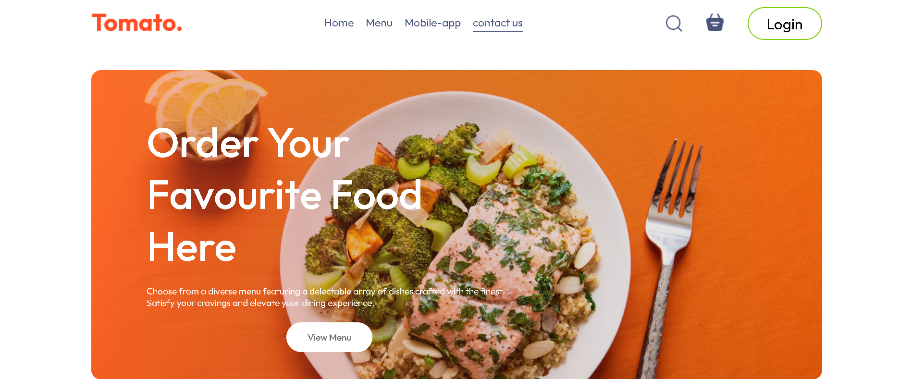
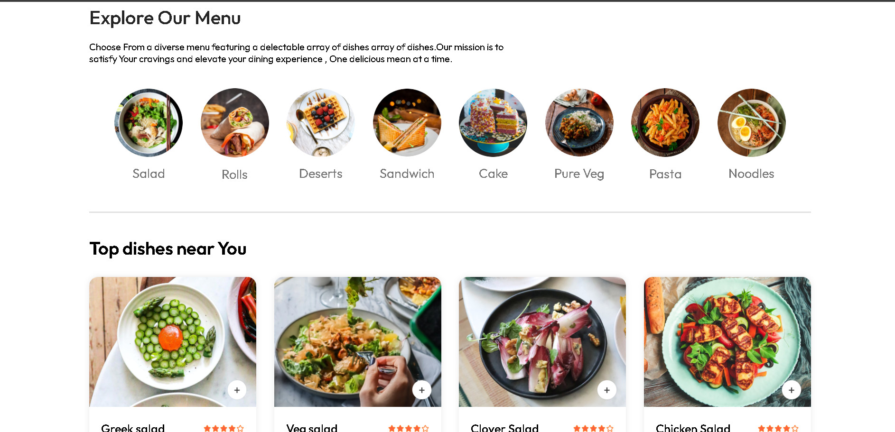
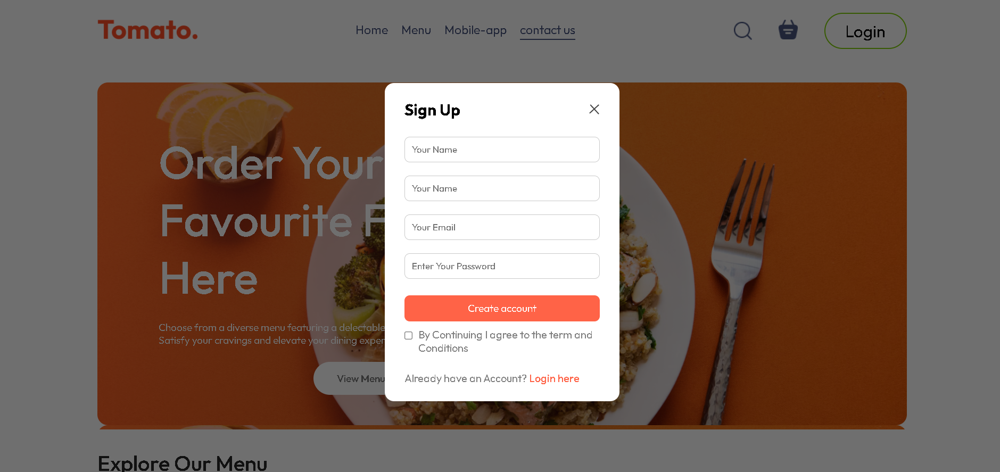

🍔 Food Ordering Website

A modern and responsive Food Ordering Website built with ReactJS and React Router DOM.
This project allows users to browse food items, add them to the cart, create an account, log in, and view the total order amount in real time.

🚀 Features
🛒 Add to Cart: Easily add/remove food items.

👤 User Authentication: Login & Create Account functionality.

💰 Dynamic Total Calculation: See the updated total amount instantly.
🔄 React Router DOM: Smooth navigation without page reloads.
📱 Responsive Design: Works on desktop, tablet, and mobile.

🛠️ Tech Stack
Frontend: ReactJS, React Router DOM
Styling: CSS
State Management: React Hooks / Context API

📷 Screenshots



📷 Screenshots



📷 Screenshots


📷 Screenshots



⚡ Installation & Setup
Clone the repository:
git clone https://github.com/DeveloperAnurag26/Food-Website-In-Reactjs.git

Navigate to project folder:
cd Food-website-In-Reactjs

Install dependencies:
npm install

Start development server:
npm run dev


```
📂 Folder Structure
food-website/
│── public/           # Static files
│── src/
│   ├── components/   # Reusable components
│   ├── pages/        # Page-level components (Home, Cart, Login, etc.)
│   ├── App.jsx        # Root component with routes
│   ├── index.jsx      # React entry point
│── package.json
│── README.md

```

🔮 Future Improvements
✅ Integration with backend (Node.js + MongoDB / Firebase).
✅ Online Payment Gateway support.
✅ Order Tracking System.

🤝 Contributing

Contributions are welcome!

Fork the repo
Create a new branch (git checkout -b feature-name)
Commit changes (git commit -m "Added feature")
Push branch (git push origin feature-name)
Open a Pull Request